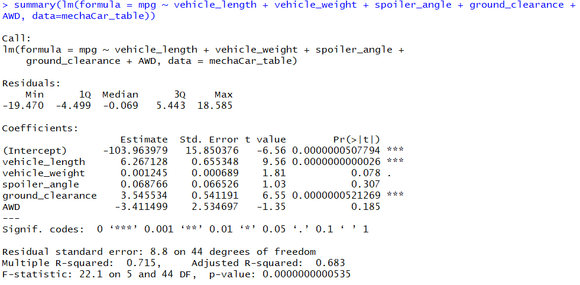
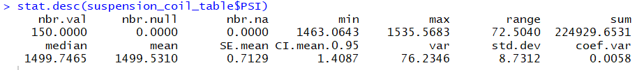
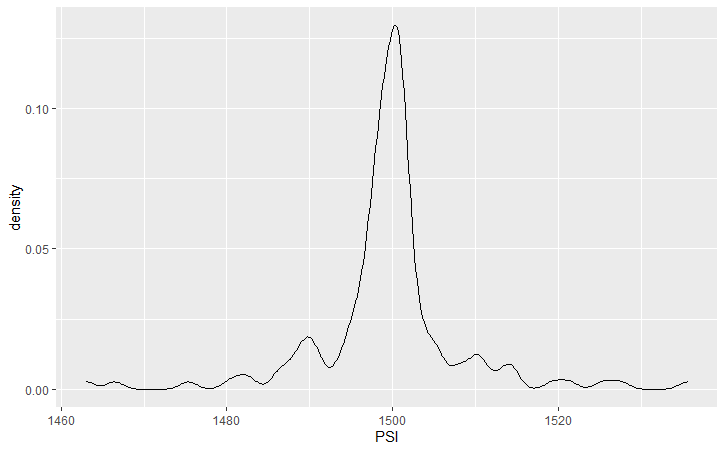
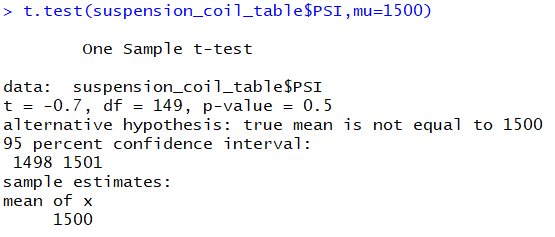

# Module 15 Challenge - MechaCar

## Challenge Overview

The goals of this challenge are to:

- Design and interpret a multiple linear regression analysis to identify variables of interest.
- Calculate summary statistics for quantitative variables.
- Perform a t-test in R and provide interpretation of results.
- Design your own statistical study to compare vehicle performance of two vehicles.

## Resources

Data Sources: [MechaCar_mpg](data_source/MechaCar_mpg.csv), [Suspension_Coil](data_source/Suspension_Coil.csv)

Software: R (with packages: tidyverse & pastecs)

## Analysis

### 1. MPG Regression

**Which variables/coefficients provided a non-random amount of variance to the mpg values in the dataset?**

According to our results, vehicle length and ground clearance (as well as intercept) are statistically unlikely to provide random amounts of variance to the linear model, therefore they do provide a significant impact over MPG. Further, since the intercept is also statistically significant, it means there are other variables and factors that contribute to the variation in MPG that have not been included in our model.

**Is the slope of the linear model considered to be zero? Why or why not?**

The slope of this linear model is not considered to be zero as the individual coefficients for vehicle length, vehicle weight, spoiler angle, ground clearance, and AWD are not zero, therefore implying there is a significant association between MPG and vehicle length (6.267128), ground clearance (3.545532), and whether the vehicle has AWD (-3.411499), and only slight association with vehicle weight (0.001245) and spoiler angle (0.068766).

**Does this linear model predict mpg of MechaCar prototypes effectively? Why or why not?**

The multiple R-squared is 0.715, meaning that approximately 72% of the variance in the measure of MPG can be predicted by vehicle length, vehicle width, spoiler angle, ground clearance, and AWD, implying that this linear model is somewhat effective at predicting MPG of MechaCar prototpes. Further analysis on additional factors not within the dataset is advised to better determine what additional factors contributes to MPG. 

### 2. Suspension Coil Summary

**Mean** = 1499.5310

**Median** = 1499.7465

**Variance** = 76.2346

**Standard deviation** = 8.7312

**Interpretation and findings**

*The design specifications for the MechaCar suspension coils dictate that the variance of the suspension coils must not exceed 100 pounds per inch. Does the current manufacturing data meet this design specification? Why or why not?*

With the current dataset (Suspension_Coil.csv), the variance of the suspension coils is less than 100 pounds per inch (76.2346). As such, the current manufacturing data meets this design specification.

### 3. Suspension Coil T-Test

**Interpretation and findings**

It is determined that a One-Sample T-Test is the appropriate test to perform as we are trying to assert if there is a statistical difference between the means of the suspension coil dataset (sample) and a hypothesized potential population dataset (with a given mean of 1500).

**Hypthosesis:**

Ho: There is NO STATISTICAL DIFFERENCE between the suspension coil sample mean and its presumed population mean.

Ha: There is A STATISTICAL DIFFERENCE between the suspension coil sample mean and its presumed population mean.

**Five assumptions about input data that need to be met in order to perform a One-Sample t-test:**

**1. The input data is numerical and continuous.** 

*Assumption is met, information is both numerical and continuous.*

**2. The sample data was selected randomly from its population data.**

*Assumption is met, sample data was (assumingly) selected randomly from its population data.*

**3. The input data is considered to be normally distributed.**

Distribution of Sample Population (n=150)

*Assumption is met as the sample data appears to be normally distributed*

**4. The sample size is reasonably large.** 

*Assumption is met as the sample datasetsize is reasonably large (n=150)

**5. The variance of the input data should be very similar.**

*Assumption is met as the variance of the sample dataset is 76, or 5% of 1,500 (assumed population mean).*

**Determine if the suspension coil’s pound-per-inch results are statistically different from the mean population results of 1,500 pounds per inch.**

Based on the results of the One-Sample T-Test, and assuming the significant level was the common 0.05 percent, our p-value (0.5) is above our significance level therefore we do not have sufficient evidence to reject the null hypothesis - the two means are statistically similar.

### 4. Design a study that compares the performance of the MechaCar prototype vehicle to other comparable vehicles on the market

**The metrics that would be of interest to a consumer and why.**

I would imagine that consumers would want to compare the overall purchase price of a vehicle to the ongoing fuel cost potential, assuming that cost-control would be an important factor in their determination of which car they would like to purchase.

**Determine what question we would ask, what the null and alternative hypothesis would be to answer that question, and what statistical test could be used to test this hypothesis.**

The study would ask: Is there a relationship between the purchase price of a vehicle and it's ongoing fuel cost.

A Linear Regression would be appropriate to use to test this hypothesis as we would want to see if there was any correlation between the purchase price and the ongoing fuel cost of the vehicle.

Ho: The slope of the linear model is zero

Ha: The slope of the linear model is not zero

**What data should be collected?**

Data that should be collected would include: car type, car purchase price (first variable for analysis), size of fuel tank, and fuel efficiency for a sufficient number of cars. In order to carry out the linear regression, we would first need to determine how many maximum kilometres could be achieved on a full tank of gas (size of fuel tank * fuel efficiency), which would in turn become our second variable for analysis.

## Report completed by:

